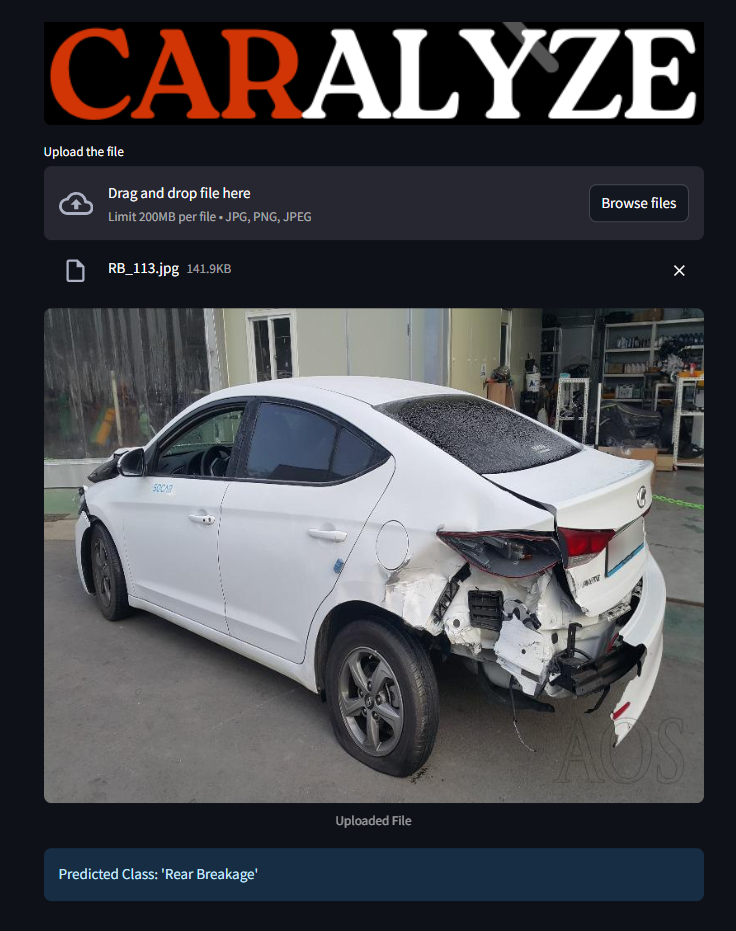

# CARALYZE – Car Damage Detection Using Deep Learning


Caralyze let's you drag and drop an image of a car and it will tell you what kind of damage it has. The model is trained on third quarter front and rare view hence the picture should capture the third quarter front or rare view of a car.

---

## 🔍 Problem Statement

Manual assessment of car damage is subjective, slow, and often error-prone. **Caralyse** solves this by leveraging computer vision to automatically analyze car images and predict the damage category—speeding up the insurance, resale, and repair processes.

---

## 🧠 Model & Technology

1. Used ResNet50 for transfer learning
2. Model was trained on around 1700 images with 6 target classes
   1. Front Normal
   1. Front Crushed
   1. Front Breakage
   1. Rear Normal
   1. Rear Crushed
   1. Rear Breakage
9. The accuracy on the validation set was around 80%

---

## 🛠️ Tech Stack

- 🖼️ **Computer Vision**: Image classification with pretrained deep learning models  
- 🐍 **Python Libraries**: PyTorch, NumPy, etc.  
- 🌐 **Web App**: [Streamlit](https://streamlit.io) for the interactive frontend  
- 📦 **Deployment**: Compatible with platforms like Streamlit Cloud, Heroku, or local hosting

---

## 📸 App Features

- Drag-and-drop or upload an image of a car
- Instantly predicts and displays the class of damage
- Responsive and clean UI
- Can be extended to include damage severity or cost estimation

---

## 🚀 Getting Started

1. **Clone the repository:**
    ```commandline
   git clone https://github.com/RAWhulKerudi/caralyze.git
   ```
2. **Install dependencies:**
    ```commandline
   pip install -r requirements.txt
   ```
3. **Run the Streamlit app:**
    ```commandline
   streamlit run app.py
   ```

---

## 📂 Project Structure

```
caralyse/
│
├── model/                        # Trained model weights
├── images/                       # UI samples, test images & logos
├── app.py                        # Streamlit web application
├── model_helper.py               # Preprocessing and prediction logic
├── README.md
└── requirements.txt
```

---

## 📊 Sample Prediction

> Upload an image like the one below and get instant results!

 

---

## 🌐 Project Links

- 🔗 GitHub Repo: [GitHub](https://github.com/RAWhulKerudi/caralyze)
- 🚀 Live App: [Demo](https://caralyze-damage-detection.streamlit.app/)

---


